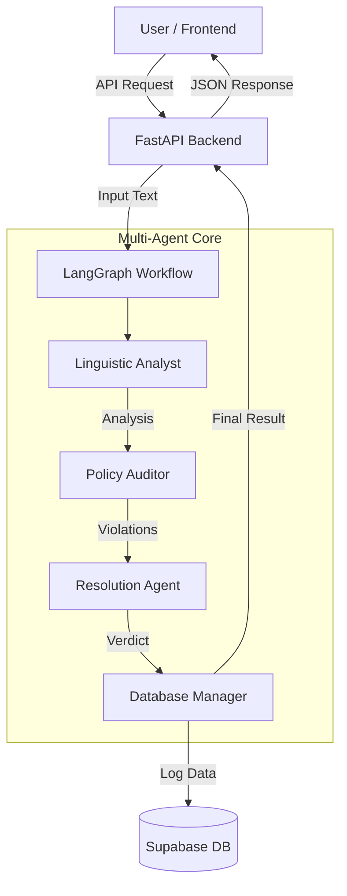

# Agentic Harassment Detection System (HarassmentShield)

> **Aligning with SDG 5 (Gender Equality) **

## 🚀 Overview
**HarassmentShield** is an advanced, Multi-Agent AI system designed to detect, classify, and mitigate online harassment with a specific focus on gender-based violence. Unlike traditional keyword filters, this system uses a team of specialized AI agents to understand context, nuance, sarcasm, and intent.


## 🏗️ System Architecture

The system follows a **Micro-Agentic Architecture** orchestrated by LangGraph.



## 🛠️ Tech Stack

### Frontend
*   **Framework**: React (Vite) + TypeScript
*   **Styling**: Tailwind CSS (Dark Mode UI)
*   **Icons**: Lucide React
*   **State Management**: React Hooks

### Backend
*   **Framework**: FastAPI (Python)
*   **AI Orchestration**: LangGraph & LangChain
*   **LLM**: Google Gemini 2.5 Flash Lite


### Database
*   **Platform**: Supabase (PostgreSQL)
*   **Security**: Row Level Security (RLS) enabled

## 🤖 How It Works (The Agents)

The system mimics a human moderation team by breaking the task into three distinct cognitive steps:

1.  **🕵️ Linguistic Analyst Agent**
    *   **Role**: The "Psychologist".
    *   **Task**: Reads the text to understand *how* it was said. Detects sarcasm, passive-aggression, slang, and emotional tone.
    *   **SDG 5 Focus**: Specifically looks for misogynistic undertones and gender stereotypes.

2.  **⚖️ Policy Auditor Agent**
    *   **Role**: The "Lawyer".
    *   **Task**: Takes the linguistic analysis and compares it against strict community guidelines.
    *   **Task**: Identifies specific violations (e.g., Hate Speech, Sexual Harassment, Threat of Violence).

3.  **🛡️ Resolution Agent**
    *   **Role**: The "Judge".
    *   **Task**: Decides the severity (Low, Medium, High, Critical) and the necessary action (Ignore, Warn, Shadowban, Report).

## ⚡ Getting Started

### Prerequisites
*   Node.js & npm
*   Python 3.11+
*   Supabase Account
*   Google Gemini API Key


### Installation

1.  **Clone the repository**
    ```bash
    git clone https://github.com/your-username/agent_online_Harassment.git
    cd agent_online_Harassment
    ```

2.  **Backend Setup**
    ```bash
    cd backend
    python -m venv venv
    # Windows
    .\venv\Scripts\activate
    # Mac/Linux
    source venv/bin/activate
    
    pip install -r requirements.txt
    ```

3.  **Frontend Setup**
    ```bash
    cd ../frontend
    npm install
    ```

### Configuration
Create a `.env` file in the `backend/` directory:

```env
GOOGLE_API_KEY=your_gemini_api_key
SUPABASE_URL=your_supabase_url
SUPABASE_KEY=your_supabase_anon_key
```

### Running the App

1.  **Start Backend** (http://localhost:8000)
    ```bash
    cd backend
    uvicorn main:app --reload
    ```

2.  **Start Frontend** (http://localhost:5173)
    ```bash
    cd frontend
    npm run dev
    ```

## 🔌 API Endpoints

| Method | Endpoint | Description |
| :--- | :--- | :--- |
| `POST` | `/api/analyze` | Analyzes a single text string. |
| `POST` | `/api/import-instagram` | Fetches and analyzes comments from an Instagram URL. |
| `GET` | `/api/history` | Retrieves the history of analyzed logs. |


